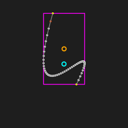
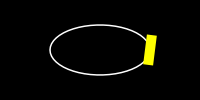

[](https://pkg.go.dev/github.com/setanarut/gog)

# GOG

GOG is a Go Object-oriented 2d drawing library for generative art


Instead of immediate drawing, each shape is a `Path{}` struct made up of points. The Path has `Fill()` `Stroke()` `FillStroke()` `StrokeFill()` functions for drawing on the canvas. There is also a `DebugDraw()` function for Debug purposes that draws all the properties of the Path.

All transformations are applied with reference to the `Path.Anchor{}` point.

- `Path.Translate()`
- `Path.SetPos()`
- `Path.Rotate()`
- `Path.Rotated()`
- `Path.Scale()`

It is possible to write the canvas (Go standard package image surface) as a static PNG file or APNG animation.

## Examples
See the [examples](./examples/) directory for all examples.

### Animation example

```Go
c := gog.New(250, 250)
curve := gog.CubicBezier(100, 95, 50, 300, 190, 88, 140, 200, 50)
curve.SetPos(c.Center).Scale(gog.P(1.3, 1.3))
for i := 0; i < 150; i++ {
	c.Clear(color.Gray{30})
	curve.Rotate((gog.Pi * 2) / 150)
	c.DebugDraw(curve)
	c.AppendAnimationFrame()
}
c.SaveAPNG("curve_anim.png", 3)
```



### Motion path example

```go
rect := gog.Rect(gog.Point{}, 30, 10)
ellipse := gog.Circle(c.Center, 50).Scale(gog.P(1, 0.5))
for _, t := range gog.Linspace(0, 1, 150) {
	c.Clear(gog.Black)
	ellipse.Stroke(c)
	p, a := ellipse.PointAngleAtTime(t)
	rect.SetPos(p).Rotated(a).SetFill(colornames.Yellow).Fill(c)
	c.AppendAnimationFrame()
}
```


